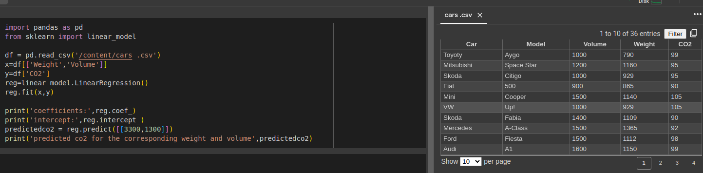

# Implementation of Multivariate Linear Regression
## Aim
To write a python program to implement multivariate linear regression and predict the output.
## Equipment’s required:
1.	Hardware – PCs
2.	Anaconda – Python 3.7 Installation / Moodle-Code Runner
## Algorithm:
### Step1
import the module pandas and scikit-learn libraies

### Step2
read csv files from the csv file using pandas

### Step3
splitting the data into features(x) and target(y)

### Step4
creating and fitting the linear regression model

### Step5
printing the coefficients and intercept of the linear regression model

### Step6
making a prediction

### Step7
printing the predicted co2 emissions


## Program:
```python
'''
Developed by: R SUDHIR KUMAR
Register number: 23000604
'''
import pandas as pd
from sklearn import linear_model

df = pd.read_csv('/content/cars .csv')
x=df[['Weight','Volume']]
y=df['CO2']
reg=linear_model.LinearRegression()
reg.fit(x,y)

print('coefficients:',reg.coef_)
print('intercept:',reg.intercept_)
predictedco2 = reg.predict([[3300,1300]])
print('predicted co2 for the corresponding weight and volume',predictedco2)

```
## Output:


## Result
Thus the multivariate linear regression is implemented and predicted the output using python program.